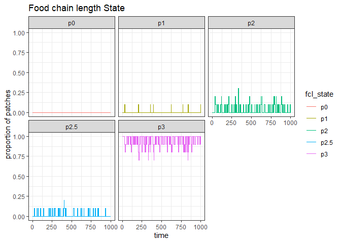
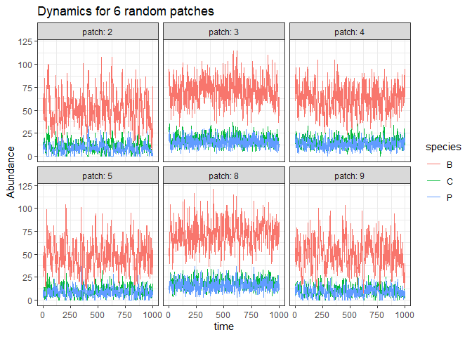
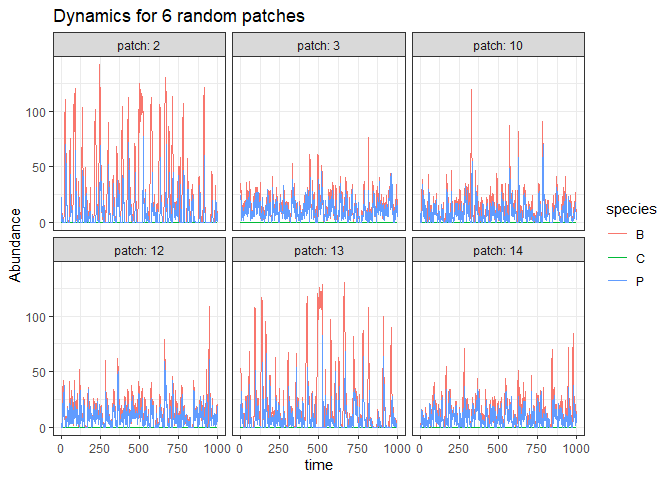

<!-- README.md is generated from README.Rmd. Please edit that file -->

# IGPtoy: functions to simulate trophic dynamics in 3-species communities in spatially explicit patches.

Justin Pomeranz 14 July, 2021

-   [Overview](#Overview)
-   [Installation](#installation)
-   [Instruction](#instruction)
    -   [`igp_sim()`](#igp_sim)
    -   [Basic usage](#basic-usage)
    -   [Quick start](#quick-start)
    -   [Custom setting: visualization](#custom-setting-visualization)
    -   [Custom setting: trophic
        parameter](#custom-setting-trophic-parameters)
    -   [Custom setting: disturbance](#custom-setting-disturbance)
    -   [Custom setting: productivity](#custom-setting-productivity)
    -   [Using with `mcbrnet`](#mcbrnet)
    -   [Custom setting: combine `brnet()` and
        `igp_sim()`](#custom-setting-combine-brnet-and-igp_sim)
    -   [Model description](#model-description)

# Overview

This is a developmental package for simulation models for Intra-Guild
Predation (IGP). It will be rolled into the `mcbrnet` package upon
completion.

-   `igp_sim`: Function `igp_sim()` simulates trophic dynamics within
    3-species communities. By default, it produces a square landscape
    with patches randomly distributed by sampling x- and y- coordinates
    from a uniform distribution. Habitat structure can be controlled by
    supplying a distance matrix. This function follows the framework of
    Zhou et al. (2013), with the addition of a 3rd species and
    intraguild predation. See [model description](#model-description)
    below for further details.

# installation

You can install the development version from
[GitHub](https://github.com/) with:

``` r
# install.packages("devtools")
devtools::install_github("Jpomz/IGPtoy")
library(IGPtoy)
```

# Instruction

## `igp_sim()`

### basic-usage

The key argument is the number of patches (`n_patch`). Trophic dynamics
are simulated through 1) local dynamics, and 2) dispersal (emigration
and immigration).

Example:

``` r
igp <- igp_sim(n_patch = 10)
#> No distance matrix supplied, assuming a 10x10 square landscape
#> 1 value of p_dispersal supplied: 0.1 for all three species
#> 1 value of s0 supplied: 0.75 for all three species
#> 1 value of theta supplied: B_theta = C_theta = P_theta = 1
#> only one value of k_base supplied, assuming it is the same in all patches
#> Predator preference varies with resource abundance
#> initial community abundance for B, C and P = 0.8, 0.5 and 0.25 * 150 respectively
```

The function returns:

-   `sp_dynamics` a data frame containing simulated trophic dynamics.
    -   *patch*: patch ID
    -   *time*: time-step
    -   *basal\_k*: carrying capacity, K, for the basal species, B
    -   *disturbance*: Binary indicator variable for if a disturbance
        occured (1) or did not occur (0) in that patch at that time-step
    -   *fcl*: food chain length in that patch at that time-step. Values
        (0, 1, 2, 3)
    -   *obs\_P\_pref*: The observed predator preference for resource B
        in that patch at that time-step
    -   *species*: Species ID (B, C, P)
    -   *value*: Population abundance for a species
-   `df_patch` a data frame containing patch attributes
    -   *patch\_id*: patch ID
    -   *disturb\_value*: disturbance level (i.e., proportional
        mortality), given a disturbance occurs, in each patch.
    -   *basal\_k*: carrying capacity, K, for the basal species, B
    -   *dens\_dep\_reg*: density dependence regulation variable =
        (r<sub>max</sub> - 1) / K
-   `fcl_state_prop` a data frame containing the proportion of patches
    that are in each FCL “state” at each time-step.
    -   *time*: time-step
    -   *fcl\_state*: character string indicating FCL state p0 = No
        species, p1 = B, p2 = B + C, p2.5 = B + P, p3 = B + C + P
    -   *value*: numeric value from 0 to 1, indicating the proportion of
        patches in a given fcl state.
-   `sim_params` A data frame containing all of the simulation
    parameters

### quick-start

The following script simulates trophic dynamics with `n_patch = 5`. By
default, `igp_sim()` uses 200 time-steps for burn-in and records trophic
dynamics for 1000 time steps.

``` r
igp <- igp_sim(n_patch = 10)
#> No distance matrix supplied, assuming a 10x10 square landscape
#> 1 value of p_dispersal supplied: 0.1 for all three species
#> 1 value of s0 supplied: 0.75 for all three species
#> 1 value of theta supplied: B_theta = C_theta = P_theta = 1
#> only one value of k_base supplied, assuming it is the same in all patches
#> Predator preference varies with resource abundance
#> initial community abundance for B, C and P = 0.8, 0.5 and 0.25 * 150 respectively
```

A named list of return values:

``` r
igp
#> $sp_dynamics
#> # A tibble: 30,000 x 8
#>    patch  time basal_k disturbance   fcl obs_P_pref species value
#>    <dbl> <dbl>   <dbl>       <dbl> <dbl>      <dbl> <chr>   <dbl>
#>  1     1     1     150           0     3      0.771 B          74
#>  2     1     1     150           0     3      0.771 C          22
#>  3     1     1     150           0     3      0.771 P          12
#>  4     2     1     150           0     3      0.812 B          39
#>  5     2     1     150           0     3      0.812 C           9
#>  6     2     1     150           0     3      0.812 P          10
#>  7     3     1     150           0     3      0.719 B          46
#>  8     3     1     150           0     3      0.719 C          18
#>  9     3     1     150           0     3      0.719 P          15
#> 10     4     1     150           0     3      0.651 B          41
#> # ... with 29,990 more rows
#> 
#> $df_patch
#> # A tibble: 10 x 4
#>    patch_id disturb_value basal_k dens_dep_reg
#>       <int>         <dbl>   <dbl>        <dbl>
#>  1        1         0.905     150         0.01
#>  2        2         0.905     150         0.01
#>  3        3         0.899     150         0.01
#>  4        4         0.903     150         0.01
#>  5        5         0.895     150         0.01
#>  6        6         0.905     150         0.01
#>  7        7         0.894     150         0.01
#>  8        8         0.905     150         0.01
#>  9        9         0.899     150         0.01
#> 10       10         0.879     150         0.01
#> 
#> $fcl_state_prop
#> # A tibble: 5,000 x 3
#>     time fcl_state value
#>    <int> <chr>     <dbl>
#>  1     1 p0            0
#>  2     1 p1            0
#>  3     1 p2            0
#>  4     1 p2.5          0
#>  5     1 p3            1
#>  6     2 p0            0
#>  7     2 p1            0
#>  8     2 p2            0
#>  9     2 p2.5          0
#> 10     2 p3            1
#> # ... with 4,990 more rows
#> 
#> $sim_params
#>        k_base k_function r_max alphabc betabc ebc alphap betap ebp ecp P_pref
#> all_sp    150         NA   2.5       4     20   2      4    20   2   2     NA
#>        p_dispersal theta   s0 disturb_type disturb_p disturb_mag_mean
#> all_sp         0.1     1 0.75           NA     1e-04              0.9
#>        disturb_mag_sd
#> all_sp            0.1
```

### custom-setting-visualization

Users can visualize the simulated dynamics in 5 random patches using
`plot_patch_dynamics = TRUE`. In addition, the proportion of FCL state
in all patches across time can be visualized using `plot_fcl = TRUE`

``` r
igp <- igp_sim(n_patch = 10, plot_patch_dynamics = TRUE, plot_fcl = TRUE)
```



### custom-setting-trophic-parameters

Users may use the following arguments to customize trophic dynamic
simulations regarding 1) predation / search effort, 2) conversion
efficiency, 3) productivity, and 4) dispersal ability.

#### Predation

Arguments `alphabc`, `betabc` and `alphap` and `betap` control the
search effort and predation rate for species C and P, respectively.
Argument `P_pref` controls the preference of predator P for resource B.

The `beta` variables control how fast the predation curve reaches the
asymptote, and `alpha` / `beta` determines the location of the
asymptote. See **Model Description** for more details. Default values
for `alpha` and `beta` parameters are 4 and 20, respectively.

`P_pref`: default is NULL, and preference is calculated for each patch
at every time step based on prey resource availability (see **model
description** for more details). If a value is supplied, it is assumed
constant across space and time and ignores resource availability.

Default values are set such as to make coexistence between all three
species likely. For example, coexistence is more likely if C outcompetes
P for resource B. We can make P a superior competitor by setting
`alphap = 10`:

``` r
igp_alpha10 <- igp_sim(alphap = 10, plot_patch_dynamics = TRUE)
```



Here, C generally goes locally extinct, and B and P are prone to extreme
oscillations

#### Conversion efficiency

Arguments `ebc`, `ebp`, and `ecp`, control the efficiency of converting
consumed resources into new consumer species. Parameters have the form
*e<sub>ij</sub>* where *i* is the resource species and *j* is the
consumer species. The default conversion efficiency values are set at 2.

#### Productivity of basal species, B

Arguments `k_function`, `k_base`, and `r_max` control the productivity
level for the basal species B.

`k_function` can be one of (NULL, “environment”, “patches-upstream”). If
`k_function = NULL`, carrying capacity does not vary across patches, and
is fixed as `k_base`. `k_function = "environment"` : Carrying capacity
varies across patches according to an environmental value. The observed
carrying capacity, K, for a patch is scaled from 50% to 150% of `k_base`
value, based on the environmental value. This is designed to work in
conjunction with the `brnet()` function from the `mcbrnet` package (See
**Custom setting combine brnet and igp\_sim** below). For 2-dimensional
networks (i.e., when a distance matrix is not supplied), an
environmental value for each patch is sampled randomly from a normal
distribution with mean = 0, and sd = 1. E.g., there is no spatial
correlation in environmental values in 2D networks.

`r_max`: controls the maximum reproductive value of the basal species,
B.

``` r
igp1 <- igp_sim(n_patch = 100, k_function = NULL)
igp2 <- igp_sim(n_patch = 100, k_function = "environment")

c(mean(igp1$df_patch$basal_k), sd(igp1$df_patch$basal_k))
#> [1] 150   0
c(mean(igp2$df_patch$basal_k), sd(igp2$df_patch$basal_k))
#> [1] 155.53000  31.31542
#plot(density(igp1$df_patch$basal_k))
#plot(density(igp2$df_patch$basal_k))
```

#### Dispersal ability

Arguments `p_dispersal` and `theta`.

`p_dispersal` controls the probability of an individual emigrating from
a patch. This can be thought of as the proportion of the population
emigrating at the beginning of each time step. If one value is supplied,
it is assumed the same for all three species. If a vector of length = 3
is supplied, this sets the probability for B, C and P, respectively.
`p_dispersal` does not vary across patches or through time.

`theta`: controls the rate of exponential decay for distance travelled
for emigrants according to *t**h**e**t**a*<sup>-1</sup>}. i.e.,
`theta = 0.1` emigrants travel far, `theta = 10` emigrants essentially
do not travel.

**WIP, below not finished**

# custom-setting-disturbance

# custom-setting-productivity

# mcbrnet

# custom-setting-combine-brnet-and-igp\_sim

# model-description

The number of prey consumed follows a Type II response according to
$$W\_{ij} = \\frac{\\alpha\_{ij}  N\_{i}  N\_{j}} {\\beta\_{ij}  N\_{j} + N\_{i}}$$
